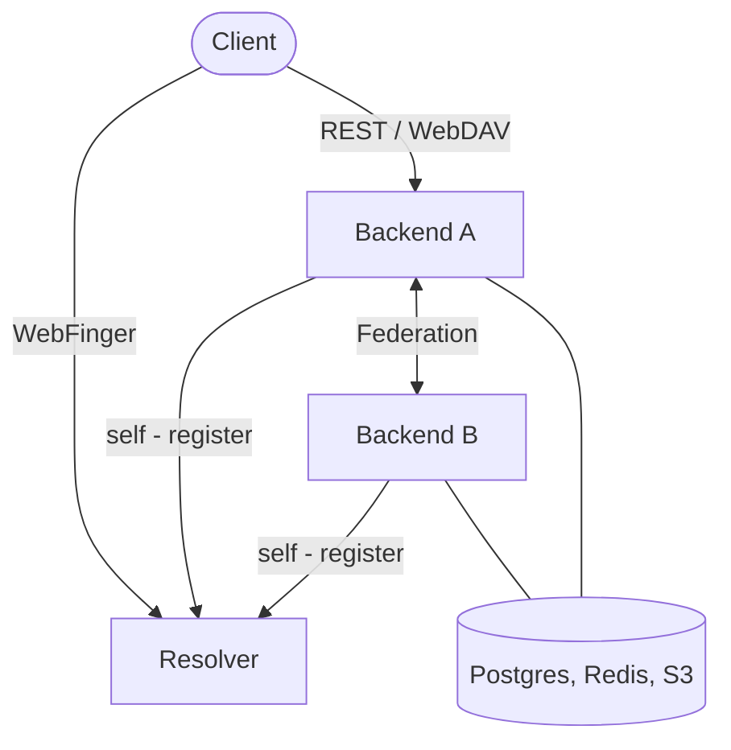

# Archypix

**Federated, self-hostable photo library** : tag-based organization, cross-instance sharing, and WebDAV-exposed tag hierarchies.

## Overview

Archypix is a self-hosted, federated photo library. It gives you full ownership of your media while letting you interact with users on other
instances, without any central authority. Instead of rigid album structures, Archypix organizes everything around **tags**: flexible, hierarchical
labels you can assign manually or through automated rules. Your tag tree can be browsed as a virtual folder hierarchy that can be synced with any
WebDAV-compatible client or OS file manager.

Archypix uses a federated identity model: users are identified as `@username:domain`, resolved across instances via the standard WebFinger protocol.
Multiple backend instances can share a single public domain through a lightweight Resolver service, or operate independently on their own domain.

> The full feature specifications are available in [doc/01_GENERAL_SPECIFICATIONS.md](doc/01_GENERAL_SPECIFICATIONS.md).

## Features

### Tags

Every picture carries any number of hierarchical tags, structured as slash-delimited paths such as `/Photos/Travel/Alps`. A picture tagged with a deep
path automatically appears under all its parent tags too: `/Photos/Travel`, then `/Photos`. Tags can be assigned manually or generated automatically
by rules you define. Deleted pictures are moved to a trash and kept for a configurable period before permanent removal.

### Automatic tagging

You can define rules that tag your pictures automatically, without manual effort:

- **By date range**: group a holiday, a trip, or any period into a tag. Nested sub-periods are supported.
- **By metadata**: EXIF fields, GPS location, filename patterns, and more.
- **By shared content**: pictures you receive from other users can be automatically mapped into your own tag hierarchy.

Rules run as an ordered pipeline, re-evaluated whenever something relevant changes: a new upload, a metadata edit, a received share. Your library
stays organized on its own.

### Hierarchies

A Hierarchy is a named, configurable view of your library organized as a virtual folder tree based on your tags. You choose which tags appear as
folders, which subtrees to collapse, and which to exclude entirely. Hierarchies and Tags are the primary ways to browse your pictures in Archypix.

Any hierarchy can also be exposed as a **WebDAV endpoint**, making your library accessible from any sync client:

- Uploading a picture into a WebDAV folder automatically assigns the corresponding tag.
- Moving a picture between folders updates its tags.
- A configurable safe-delete mode protects against accidental bulk deletions from naive sync clients.

### Sharing

Archypix is federated: every instance is a peer, and no central server is required to coordinate sharing.

- Share pictures under a tag with a user on another instance.
- Shared pictures are never re-uploaded: recipients download them directly from your server.
- Optionally, new pictures added to the shared tag are announced to recipients automatically.
- Sharing is transitive: a recipient can re-share a collection that includes pictures owned by others.
- Revoke a share at any time; the revocation propagates to all downstream recipients immediately.

### Versioning and storage

Files are stored in any S3-compatible object store (MinIO, AWS S3, Backblaze B2...). File downloads use short-lived presigned URLs generated by the
storage backend, keeping large file traffic off the application server. Picture versioning is available and configurable per user.

## Architecture

Archypix is composed of two server-side services:

| Component                                                                 | Role                                                                                                                         |
|---------------------------------------------------------------------------|------------------------------------------------------------------------------------------------------------------------------|
| [**Resolver**](https://github.com/ClementGre/Archypix/tree/main/resolver) | WebFinger service. Maps `@username:domain` to the owning backend. Routes new user registrations to the least-loaded backend. |
| [**Backend**](https://github.com/ClementGre/Archypix/tree/main/back)      | Axum HTTP server. Authoritative store for users, pictures, tags, and shares. Serves the REST API and WebDAV.                 |
| **Workers** *(planned)*                                                   | Async job pool for thumbnails, ML inference, face detection, geo clustering.                                                 |

## The Story of Archypix

### December 2022 — PicturesManager

The project started as [**PicturesManager**](https://github.com/ClementGre/PicturesManager), a desktop photo manager built
with [Tauri](https://tauri.app/). The stack was unusual by choice: a Rust backend coupled with a Rust [WebAssembly](https://webassembly.org/) frontend
written in [Yew](https://yew.rs/), fast, safe, and entirely in one language. The core idea was already there: automatic grouping rules to organize
pictures without manual effort.

### March 2024 — PMCloud

[**PMCloud**](https://github.com/ClementGre/PMCloud) moved the project to the cloud. The desktop shell was dropped in favor of
a [Vue.js](https://vuejs.org/) web frontend backed by a [Rocket](https://rocket.rs/) API and [Diesel](https://diesel.rs/) ORM. The signature feature
of this iteration was shared groups: multiple users could collaborate on the same event's pictures while each keeping their own automatic grouping
rules applied on top.

### January 2025 — Archypix (first generation)

The project was rebranded as **Archypix** — *Archy* for the structured, architectural way it lets you organize your library, *pix* for pictures. The
technology stack was carried forward and the codebase underwent a major
refactoring ([back](https://github.com/ClementGre/old-archypix-app-back) / [front](https://github.com/ClementGre/old-archypix-app-front)), laying
groundwork for the ambitions of the next phase.

### January 2026 — Archypix (current, from scratch)

Development restarted from a blank slate with an entirely new specification. The central breakthrough: Archypix became **decentralized**. Instances
are peers — any instance can share with any other, world-wide, without a central registry. A single public domain can host multiple backend instances
for scaling or migration, and completely independent domains federate natively. The tagging model was redesigned around hierarchical paths and
automated pipelines, and hierarchies were introduced as the primary way to browse and sync the library.

This is the Archypix we are building today, and there is a lot left to implement. Contributions and ideas are very welcome.

## License

Archypix is released under the [GNU Affero General Public License v3.0](https://github.com/ClementGre/Archypix/blob/main/LICENSE).

In short: you are free to use, modify, and distribute Archypix, but any modified version you run as a network service must also be made available
under the same license.
