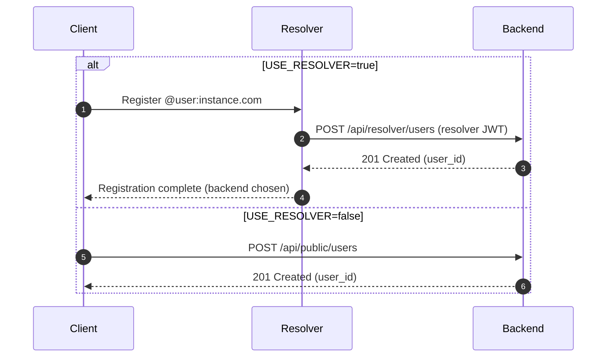
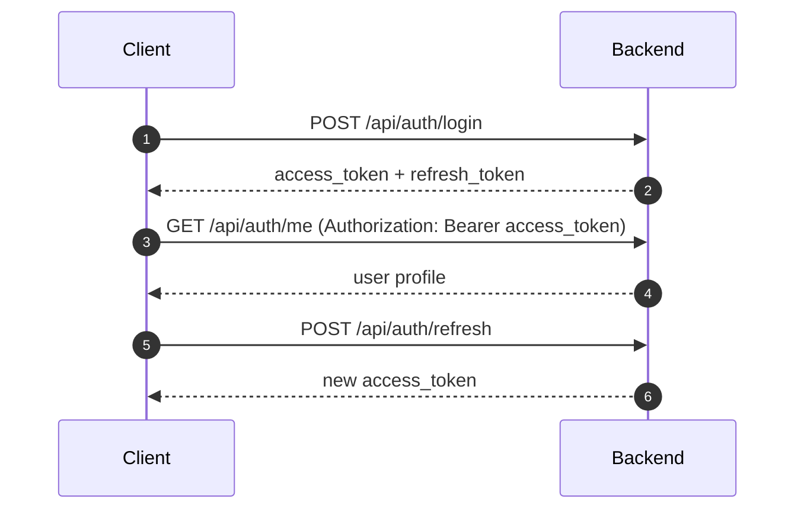
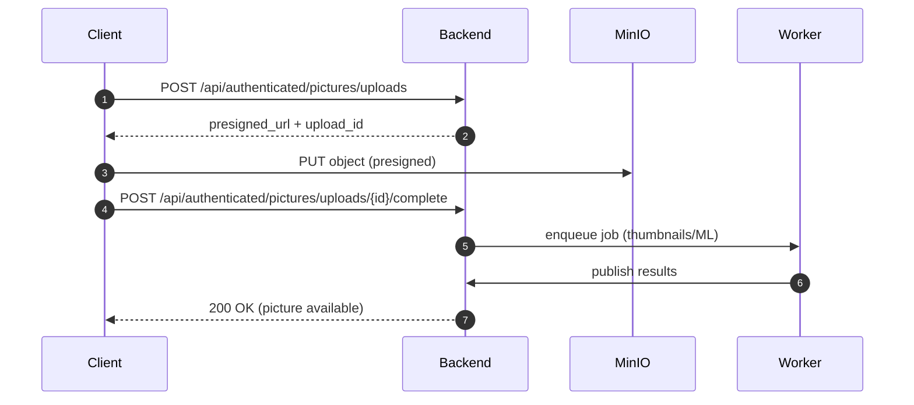
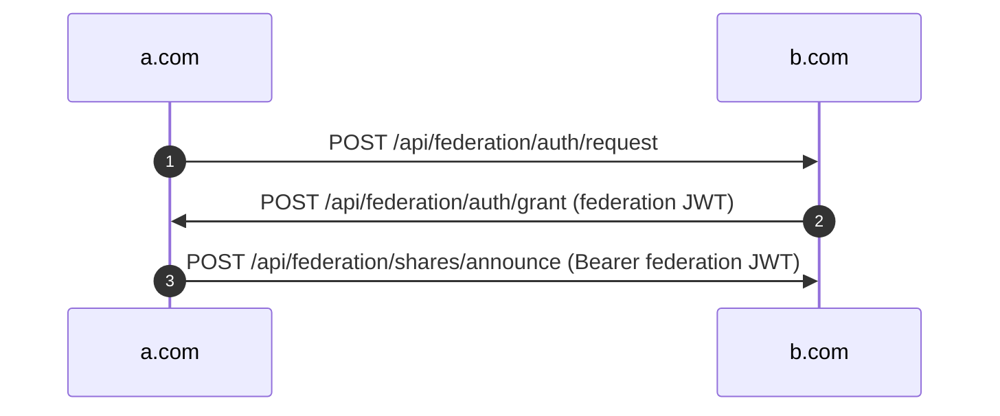
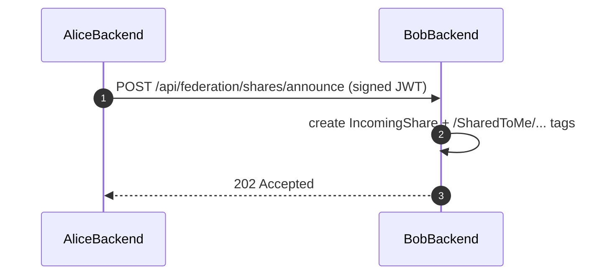
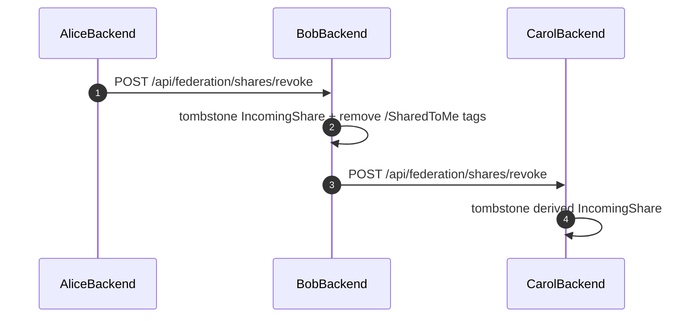

# Backend Architecture

## A) Technology considerations

### Framework Choice: Axum
- Already proven in resolver component
- Excellent async/await support with Tokio
- Robust routing, middleware (via Tower), and error handling
- Consistent codebase across resolver and backend
- Good performance and scalability for microservices

### Database Access: SQLx
- Excellent PostgreSQL feature support (LTREE, JSONB, custom types, etc.)
- Compile-time checked SQL with macros
- Direct SQL control for performance optimization
- Team familiarity from resolver implementation
- Migration capabilities already in use
- Reduced abstraction overhead compared to ORMs

## B) Layered architecture and responsibilities

**Goal:** clean separation between HTTP API, business workflows, domain rules, database access, and infrastructure connectivity.

| Layer            | Responsibility                                                                                                 | Can depend on                                             | Must NOT depend on                                                                  |
|------------------|----------------------------------------------------------------------------------------------------------------|-----------------------------------------------------------|-------------------------------------------------------------------------------------|
| `api`            | HTTP handlers, auth extraction, request/response mapping. Can call repositories directly for single-step CRUD. | `services`, `domain`, `database`, `infrastructure::error` | External connectivity details (Redis/S3/HTTP clients) outside `AppState` injection. |
| `services`       | Multi-step workflows and orchestration. Defines transaction boundaries.                                        | `domain`, `database`, infra traits                        | Axum request types, HTTP-specific models.                                           |
| `domain`         | Business rules, validation, transformations, and pure value types.                                             | Nothing outside Rust std + lightweight crates             | `database`, `infrastructure`, or external clients.                                  |
| `database`       | Repository-only SQL operations (no business logic).                                                            | `sqlx`, `domain` types, `infrastructure::error`           | `services`, external clients.                                                       |
| `infrastructure` | Connectivity (config, error, Redis, S3, HTTP clients, app state). Implements service traits when applicable.   | External SDKs                                             | `api` business logic, `domain` rules.                                               |

Notes:

- Services should be oriented by **business capability** (e.g., `user_account`), not by API emitter (admin/public/resolver).
- Infrastructure can expose adapters that implement traits used by services. This keeps services decoupled from concrete Redis/S3/HTTP
  implementations.

## C) Transactions and database access

**Rule:** all repository functions accept an `Executor<'e, Database = Postgres>` so they can run on either a `PgPool` or a transaction.

- Multi-step workflows (e.g., user creation, picture upload) **must** run in an explicit SQL transaction managed by a service.
- API handlers can call repositories directly **only** for single-step CRUD with no domain rule composition.

Example signature (pattern):

```rust
pub async fn create<'e, E>(ex: E, ...) -> Result<Entity, AppError>
where
    E: Executor<'e, Database=Postgres>,
```

# Backend REST API Structure (updated)

This document defines the REST API layout for `/back/src/api`, middleware usage, and core flows (including federation). It aligns with the current
Axum/SQLx stack and the existing schema.

## 1) API layout and base paths

The router lives directly in `src/api.rs` (no `routes.rs` files).

| Section                      | Base path                      | Auth                                    | Purpose                                                                    |
|------------------------------|--------------------------------|-----------------------------------------|----------------------------------------------------------------------------|
| Resolver endpoints           | `/api/resolver/*`              | JWT signed with `RESOLVER_ADMIN_SECRET` | Endpoints called by the Resolver to create users when `USE_RESOLVER=true`. |
| Admin endpoints              | `/api/admin/*`                 | Admin JWT                               | Instance-level operations.                                                 |
| Public/auth endpoints        | `/api/auth/*`, `/api/public/*` | Mixed                                   | Login/refresh and public lookups.                                          |
| Authenticated user endpoints | `/api/authenticated/*`         | User JWT                                | Main user API (pictures, tags, shares).                                    |
| Federation endpoints         | `/api/federation/*`            | Federation JWT (pairwise)               | Cross-instance messaging.                                                  |

### Base path options for authenticated user endpoints

**Recommended default:** `/api/authenticated/*` to make the auth boundary explicit.  
**Alternatives:** `/api/user/*` (short), `/api/app/*` (generic), or `/api/general/*` (your initial suggestion).  
The rest of this document assumes `/api/authenticated/*`.

## 2) JWT tokens (users, admin, resolver, federation)

All auth types use JWT with a shared claim shape:

| Claim               | Description                                         |
|---------------------|-----------------------------------------------------|
| `sub`               | Username (or service name for resolver/federation). |
| `uid`               | User UUID (for user/admin tokens).                  |
| `instance`          | Instance domain that issued the token.              |
| `token_type`        | `user` \| `admin` \| `resolver` \| `federation`.    |
| `is_admin`          | Boolean (true for admin tokens).                    |
| `aud`               | Target backend instance domain.                     |
| `exp`, `iat`, `jti` | Standard JWT lifecycle and replay protection.       |

**Resolver JWT**  
The Resolver signs JWTs using `RESOLVER_ADMIN_SECRET`. The backend validates `token_type=resolver` + `aud`.

**User/admin JWT**  
Issued by the backend after login (or admin auth). The backend validates `token_type=user/admin`.

## 3) Federation authentication protocol (pairwise JWT)

We use a pairwise token scheme: the **recipient instance** issues a JWT to the **requesting instance**. This avoids public-key verification on every
request and ensures tokens are delivered only to the true domain owner.

### Handshake

1. **Token request**  
   `A -> B`  
   `POST /api/federation/auth/request`  
   Body: `{ requester_instance, callback_url, scope, nonce }`

2. **Token grant**  
   `B -> A`  
   `POST /api/federation/auth/grant` (to A’s callback URL)  
   Body: `{ issuer_instance, token, expires_at, scope, nonce }`

3. **Usage**  
   A stores the token and uses it to call `B`’s federation endpoints:  
   `Authorization: Bearer <federation_jwt>`

**Notes**

- The grant is sent server-to-server to the callback on the requester’s domain, ensuring only the real instance receives it.
- Tokens are short-lived; re-requested as needed.
- All federation endpoints validate `token_type=federation`, `aud`, and optional scope.

## 4) Middleware stack (Axum/Tower)

Applied in this order (outermost first):

| Middleware  | Applies to                           | Purpose                                          |
|-------------|--------------------------------------|--------------------------------------------------|
| Request ID  | All                                  | Correlate logs across services.                  |
| Trace       | All                                  | Structured request logs with latency and status. |
| Timeout     | All                                  | Bound request time (e.g., 30s).                  |
| Body limit  | Upload endpoints                     | Prevent oversized JSON payloads.                 |
| CORS        | `/api/*`                             | Browser access from `front_url`.                 |
| Compression | All (except uploads)                 | Reduce JSON response size.                       |
| Rate limit  | Auth + federation + public endpoints | Abuse control (Redis-backed).                    |
| Auth        | By route group                       | Enforce identity type.                           |

## 5) File structure (`/back/src/api`)

No `mod.rs` or `routes.rs` files. Each top-level module has a same-named file in the parent directory.

```
src/
  api.rs                 # router composition (top-level)
  api/
    middleware.rs
    middleware/
    resolver.rs
    resolver/
    admin.rs
    admin/
    user.rs
    user/
    federation.rs
    federation/
```

## 6) Endpoint layout (initial set)

### 6.1 Resolver endpoints

| Method | Path                             | Description                                                  |
|--------|----------------------------------|--------------------------------------------------------------|
| `POST` | `/api/resolver/users`            | Create user on this backend (only when `USE_RESOLVER=true`). |
| `GET`  | `/api/resolver/users/{username}` | Fetch user by username for resolver validation.              |

### 6.2 Admin endpoints

| Method   | Path                    | Description                   |
|----------|-------------------------|-------------------------------|
| `GET`    | `/api/admin/users`      | List users.                   |
| `POST`   | `/api/admin/users`      | Create user (admin override). |
| `PATCH`  | `/api/admin/users/{id}` | Suspend/restore, set role.    |
| `DELETE` | `/api/admin/users/{id}` | Delete user.                  |
| `GET`    | `/api/admin/jobs`       | Inspect job queue/status.     |
| `GET`    | `/api/admin/metrics`    | Metrics snapshot.             |

### 6.3 Public/auth endpoints

| Method | Path                           | Description                                       |
|--------|--------------------------------|---------------------------------------------------|
| `POST` | `/api/auth/login`              | Login (username + password).                      |
| `POST` | `/api/auth/refresh`            | Refresh access token.                             |
| `POST` | `/api/auth/logout`             | Revoke session/refresh token.                     |
| `GET`  | `/api/auth/me`                 | Current user profile (requires user JWT).         |
| `GET`  | `/api/public/users/{username}` | Public profile lookup.                            |
| `POST` | `/api/public/users`            | Register user (**only if `USE_RESOLVER=false`**). |

### 6.4 Authenticated user endpoints (`/api/authenticated/*`)

**Users**

| Method  | Path                          | Description              |
|---------|-------------------------------|--------------------------|
| `PATCH` | `/api/authenticated/users/me` | Update profile/settings. |

**Pictures & uploads**

| Method | Path                                                | Description                            |
|--------|-----------------------------------------------------|----------------------------------------|
| `POST` | `/api/authenticated/pictures/uploads`               | Create upload session + presigned URL. |
| `POST` | `/api/authenticated/pictures/uploads/{id}/complete` | Finalize upload (enqueue jobs).        |
| `GET`  | `/api/authenticated/pictures`                       | List/search pictures.                  |
| `GET`  | `/api/authenticated/pictures/{id}`                  | Picture details (metadata, tags).      |
| `GET`  | `/api/authenticated/pictures/{id}/download`         | Presigned URL for original/derivative. |

**Tags**

| Method   | Path                                    | Description                          |
|----------|-----------------------------------------|--------------------------------------|
| `GET`    | `/api/authenticated/tags`               | List tags (with ancestor expansion). |
| `POST`   | `/api/authenticated/tags`               | Assign tags (batch).                 |
| `DELETE` | `/api/authenticated/tags`               | Remove tags (batch).                 |
| `POST`   | `/api/authenticated/pictures/{id}/tags` | Assign tags to a picture.            |
| `DELETE` | `/api/authenticated/pictures/{id}/tags` | Remove tags from a picture.          |

**Sharing**

| Method | Path                                             | Description            |
|--------|--------------------------------------------------|------------------------|
| `POST` | `/api/authenticated/shares/outgoing`             | Create outgoing share. |
| `GET`  | `/api/authenticated/shares/outgoing`             | List outgoing shares.  |
| `GET`  | `/api/authenticated/shares/incoming`             | List incoming shares.  |
| `POST` | `/api/authenticated/shares/incoming/{id}/accept` | Accept incoming share. |
| `POST` | `/api/authenticated/shares/incoming/{id}/reject` | Reject incoming share. |

### 6.5 Federation endpoints

| Method | Path                                | Description                                            |
|--------|-------------------------------------|--------------------------------------------------------|
| `POST` | `/api/federation/auth/request`      | Request a federation JWT (pairwise).                   |
| `POST` | `/api/federation/auth/grant`        | Receive a federation JWT from another instance.        |
| `POST` | `/api/federation/shares/announce`   | Share announcement (includes optional `shareback_of`). |
| `POST` | `/api/federation/shares/revoke`     | Share revocation.                                      |
| `POST` | `/api/federation/pictures/announce` | Announce pictures for an active share.                 |
| `POST` | `/api/federation/pictures/presign`  | Request presigned URL from original owner backend.     |

### 6.6 WebDAV

WebDAV runs on a separate route, e.g. `/dav/*`, and uses the same user JWT auth.

## 7) Main flows

### 7.1 User creation (with and without resolver)



### 7.2 Authentication and session flow



### 7.3 Picture upload and tagging pipeline



### 7.4 Federation auth handshake



### 7.5 Federation: share announcement and receipt



### 7.6 Federation: share revocation



## 8) WebDAV + storage behavior

- WebDAV lives under `/dav/*` and maps tags to virtual directories (see hierarchy spec).
- For WebDAV clients, the backend **proxies** file downloads/uploads to MinIO when presigned URLs are not suitable.
- REST clients can still use presigned URLs for direct MinIO transfers.

## 9) Share consistency and deduplication (spec)

This spec builds on the current schema in `back/migrations/001_initial_schema.up.sql`.

### 9.1 Picture identity

- **Owned picture:** `local_user_id = owner`, `owner_username/owner_instance_domain = NULL`.
- **Received picture:** `local_user_id = recipient`, `owner_username/owner_instance_domain = original owner`.
- **Global identity:** `(owner_username, owner_instance_domain, picture_id)` for received pictures; `(local_user_id, picture_id)` for owned pictures.

### 9.2 Deduplication rules

When a share announcement includes picture IDs:

1. Attempt `INSERT INTO pictures … ON CONFLICT (local_user_id, picture_id) DO UPDATE` (or `DO NOTHING`).
2. The unique constraint `(local_user_id, picture_id)` is the deduplication key: `picture_id` is a UUID, globally unique in practice, so no extra
   composite key is needed.
3. On conflict, only update tags/shares for the existing row; do not overwrite storage fields.

Idempotency at the federation message level is enforced via `federation_messages.idempotency_key` (unique constraint).

### 9.3 Storage and access

- The original owner stores `s3_key` + `s3_bucket` in MinIO.
- The receiving backend stores those values for reference only.
- To access a remote file, the receiver requests a presigned URL from the owner backend:
    - `POST /api/federation/pictures/presign` with `{ owner_username, owner_instance_domain, picture_id, variant }`
    - Owner validates that an **active share** exists for the requesting instance.
    - Owner returns a short-lived presigned URL.

### 9.4 Transitive sharing

Transitive shares **never** re-upload or re-host blobs. The announcement always references the original owner identity and `picture_id`. Recipients
fetch blobs directly from the original owner via presigned URLs.

### 9.5 s3_key stability

- `s3_key` is **stable** for the lifetime of the picture.
- Revocation is enforced by refusing presign for revoked shares (and keeping presigned URLs short-lived).
- If a hard reset is required, rotate `s3_key`, then **re-announce** affected pictures to all active shares.

## 10) Not-yet-developed items

1. Federation token storage, rotation schedule, and retry logic.
2. Concrete JWT claim validation rules and scopes for federation requests.
3. Redis-backed rate limits and session invalidation.
