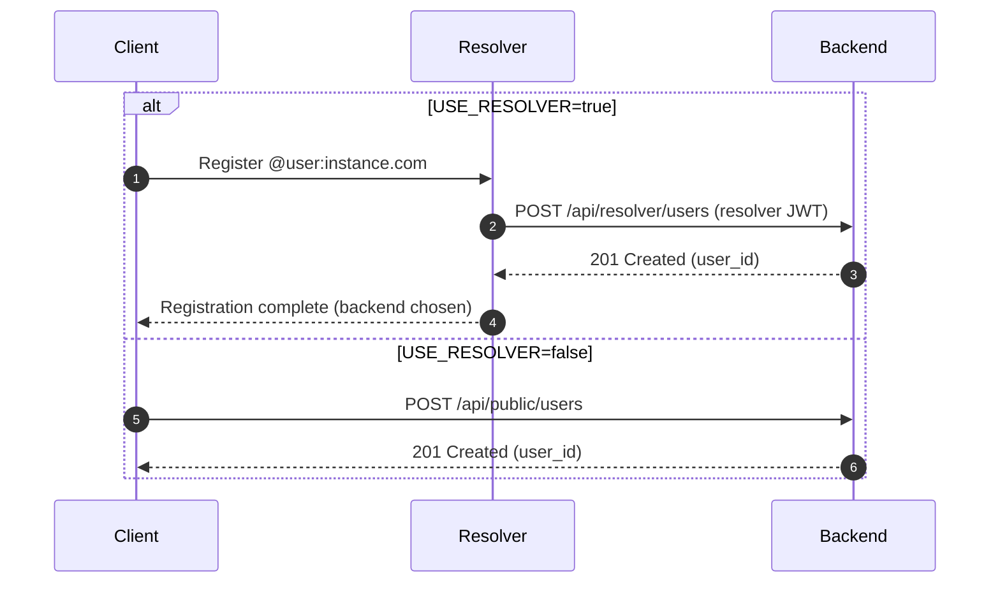
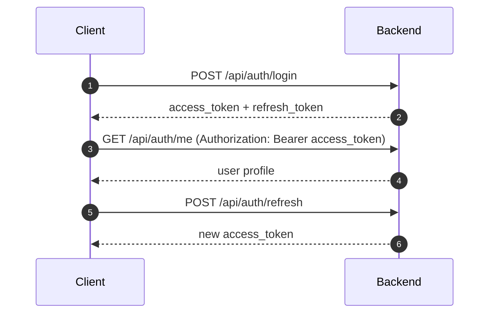
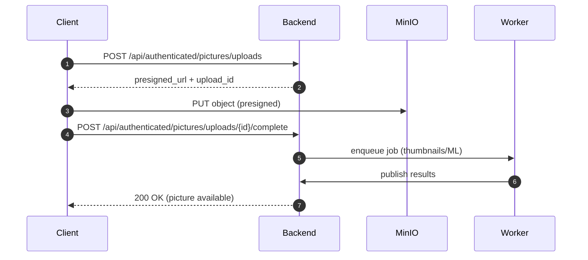
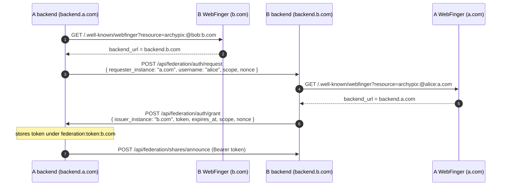
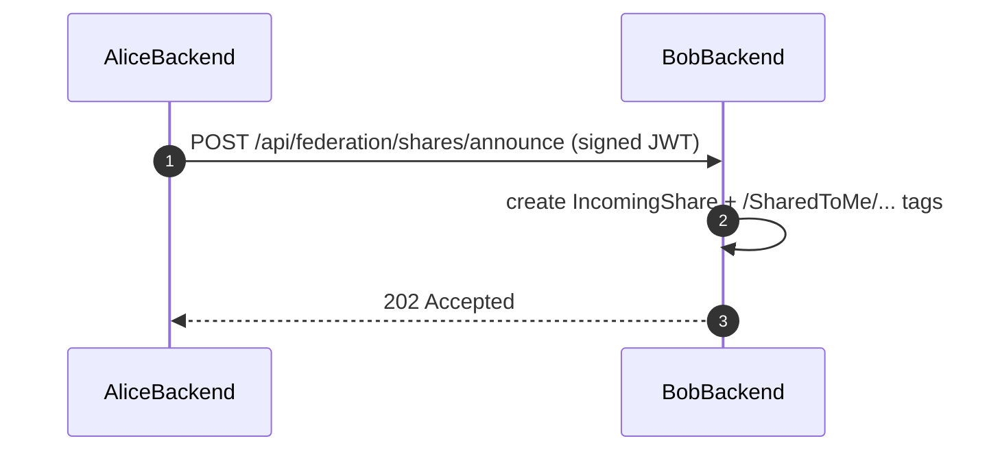
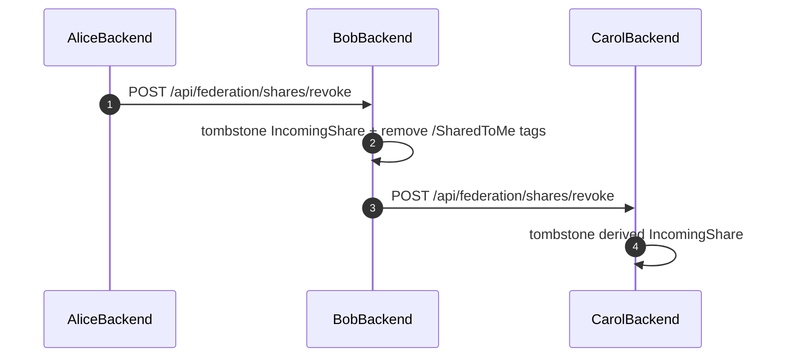

# Backend Architecture

## A) Technology considerations

### Framework Choice: Axum
- Already proven in resolver component
- Excellent async/await support with Tokio
- Robust routing, middleware (via Tower), and error handling
- Consistent codebase across resolver and backend
- Good performance and scalability for microservices

### Database Access: SQLx
- Excellent PostgreSQL feature support (LTREE, JSONB, custom types, etc.)
- Compile-time checked SQL with macros
- Direct SQL control for performance optimization
- Team familiarity from resolver implementation
- Migration capabilities already in use
- Reduced abstraction overhead compared to ORMs

---

## B) Layered architecture and responsibilities

**Goal:** clean separation between HTTP API, business workflows, domain rules, database access, and infrastructure connectivity.

| Layer        | Responsibility                                                                                             | Can depend on                                                | Must NOT depend on                              |
|--------------|------------------------------------------------------------------------------------------------------------|--------------------------------------------------------------|-------------------------------------------------|
| `api`        | HTTP handlers, auth extraction, request/response models. Calls repositories directly for single-step CRUD. | `services`, `repository`, `domain`, `infra::error`           | External connectivity details outside AppState. |
| `services`   | Multi-step workflows and orchestration. Owns transaction boundaries.                                       | `repository`, `clients`, `domain`, `infra`                   | Axum request types, HTTP-specific models.       |
| `clients`    | Outbound HTTP adapters. Wraps calls to external systems (federation backends, resolver, S3).               | `infra`, `domain`                                            | `services`, `repository`, `api`.                |
| `repository` | SQL operations only — no business logic.                                                                   | `domain` (types), `infra::error`                             | `services`, `clients`.                          |
| `domain`     | Business types, invariants, pure transformations, and the tagging pipeline evaluator.                      | std + lightweight crates (serde, uuid, chrono, sqlx derives) | `repository`, `infra`, external clients.        |
| `infra`      | Raw connectivity primitives: config, error, Redis, S3, crypto (JWT, hashing).                              | External SDKs                                                | `api`, `services`, `clients`.                   |
| `state`      | `AppState` — application bootstrap, holds all composed clients and infra handles.                          | `infra`, `clients`                                           | `services`, `repository`, `api`.                |

**Key rules:**

- Services are oriented by **business capability** (`users`, `auth`, `pictures`, `shares`), not by API emitter.
- All repository functions accept `Executor<'e, Database = Postgres>` so they run on either a `PgPool` or a transaction.
- Multi-step workflows (user creation, picture upload, share creation) **must** run in an explicit SQL transaction managed by a service.
- API handlers call repositories directly **only** for single-step CRUD with no orchestration.

### Dependency graph

```
api       → services, repository, domain, infra
services  → repository, clients, domain, infra
clients   → infra, domain
repository→ domain, infra
domain    → (std, serde, uuid, chrono, sqlx derives only)
infra     → (external crates)
state     → infra, clients        ← no cycle: clients depend on infra only
```

`AppState` lives in the top-level `state` module rather than inside `infra` to avoid a circular dependency (`infra → clients → infra`).

---

## C) Module layout (`back/src/`)

Rust's file-based module convention is followed throughout: a module `foo` with submodules lives at `foo.rs` (the parent file) + `foo/` (the submodule
directory). No `mod.rs` files are used.

```
back/src/
  main.rs              # Bootstrap: build AppState, start Axum server
  state.rs             # AppState definition

  domain.rs            # pub mod declarations
  domain/
    auth.rs            # TokenType, JwtClaims
    user.rs            # User, UserCredential, RefreshToken
    picture.rs         # Picture, UploadSession
    tag.rs             # TagPath (newtype), TagSource, Tag
    share.rs           # ShareStatus, OutgoingShare, IncomingShare
    federation.rs      # FederationMessage, direction/status enums, BackendMapping
    job.rs             # Job, JobStatus, JobType
    tagging.rs         # TaggingService config types, Hierarchy; declares tagging/
    tagging/
      pipeline.rs      # Pure pipeline evaluator (no I/O)

  repository.rs
  repository/
    user.rs            # UserRepository
    picture.rs         # PictureRepository
    tag.rs             # TagRepository
    share.rs           # OutgoingShareRepository, IncomingShareRepository
    auth.rs            # CredentialRepository, RefreshTokenRepository

  clients.rs
  clients/
    federation.rs      # FederationClient (WebFinger, token lifecycle, announce_share)
    resolver.rs        # ResolverClient (update_mapping, verify_token)

  services.rs
  services/
    auth.rs            # login(), refresh(), logout()
    users.rs           # create_user()
    pictures.rs        # begin_upload(), complete_upload()
    shares.rs          # create_outgoing_share()

  api.rs               # Router composition
  api/
    middleware.rs      # bearer_token() helper
    middleware/
      auth_user.rs     # AuthUser extractor (user/admin JWT)
      auth_admin.rs    # AuthAdmin extractor (admin JWT)
      auth_resolver.rs # AuthResolver extractor (resolver JWT)
      auth_federation.rs # AuthFederation extractor (federation JWT)
    user.rs            # auth_routes(), public_routes(), authenticated_routes()
    user/
      auth.rs          # login, refresh, logout, me handlers
      users.rs         # register, get_public, update_me handlers
      pictures.rs      # upload, list, get, download handlers
      shares.rs        # share create/list/accept/reject handlers
      tags.rs          # tag list/assign/remove handlers
    admin.rs           # routes()
    admin/
      handlers.rs
      models.rs        # CreateUserRequest, UpdateUserRequest, UserResponse
    federation.rs      # routes()
    federation/
      handlers.rs
      models.rs        # FederationAuthRequest, ShareRevokeRequest, PresignRequest
    resolver.rs        # routes()
    resolver/
      handlers.rs
      models.rs

  infra.rs
  infra/
    config.rs          # Config (loaded from env)
    error.rs           # AppError, map_sqlx_error
    redis.rs           # RedisClient, connect()
    crypto.rs          # JwtService, hash_password(), verify_password(),
                       # generate_refresh_token(), hash_refresh_token()
    db.rs              # connect(), run_migrations()
    s3.rs              # StorageClient (presign_get/put), connect()
```

---

## D) What belongs where — decision guide

| Code                                                 | Layer                           | Reasoning                                                  |
|------------------------------------------------------|---------------------------------|------------------------------------------------------------|
| `TokenType`, `JwtClaims`                             | `domain/auth.rs`                | Pure value types, no I/O                                   |
| `TagPath` newtype + methods                          | `domain/tag.rs`                 | Business invariants, pure                                  |
| `OutgoingShare::would_loop_to()`                     | `domain/share.rs`               | Domain rule, pure                                          |
| Pipeline evaluator                                   | `domain/tagging/pipeline.rs`    | Pure business logic, testable without I/O                  |
| SQL queries                                          | `repository/`                   | SQL only, no business logic                                |
| WebFinger resolution + global→backend domain mapping | `clients/federation.rs`         | Outbound HTTP adapter; caches backend domains in Redis     |
| Login/refresh workflow                               | `services/auth.rs`              | Multi-step: DB + crypto + token generation                 |
| Upload workflow                                      | `services/pictures.rs`          | Multi-step: Redis session + S3 presign + DB record         |
| Share creation                                       | `services/shares.rs`            | Multi-step: DB + federation announce                       |
| JWT signing keys, argon2 hashing                     | `infra/crypto.rs`               | Infrastructure crypto primitives                           |
| S3 presigned URLs                                    | `infra/s3.rs` → `StorageClient` | Infrastructure adapter                                     |
| HTTP handler                                         | `api/*/`                        | Thin: extract input → call service/repo → serialize output |

---

## E) Transactions and database access

**Rule:** all repository functions accept `Executor<'e, Database = Postgres>`:

```rust
pub async fn create<'e, E>(ex: E, ...) -> Result<Entity, AppError>
where
    E: Executor<'e, Database = Postgres>,
```

This allows calling them on either `&PgPool` (single-step handlers) or `&mut PgTransaction` (multi-step services):

```rust
// services/users.rs — transaction managed by the service
let mut tx = db.begin().await?;
let user = UserRepository::create( & mut * tx,...).await?;
CredentialRepository::upsert_password( & mut * tx, user.id, & hash).await?;
tx.commit().await?;
```

---

## F) AppState

`AppState` is defined in `state.rs` at the crate root. It holds all composed infrastructure handles — no business logic lives here.

```rust
pub struct AppState {
    pub config: Config,
    pub db: PgPool,
    pub redis: RedisClient,
    pub jwt: JwtService,        // user/admin/federation token verification
    pub storage: StorageClient, // S3 presigned URL operations
    pub federation: FederationClient, // outbound federation HTTP
    pub resolver: ResolverClient,     // outbound resolver HTTP
}
```

`FederationClient` and `ResolverClient` are constructed once in `main.rs` and cloned into each handler via Axum's `State` extractor.

---

# Backend REST API Structure

## 1) API layout and base paths

The router is composed in `src/api.rs` (no `routes.rs` files).

| Section                      | Base path                      | Auth                                    | Purpose                                                                    |
|------------------------------|--------------------------------|-----------------------------------------|----------------------------------------------------------------------------|
| Resolver endpoints           | `/api/resolver/*`              | JWT signed with `RESOLVER_ADMIN_SECRET` | Endpoints called by the Resolver to create users when `USE_RESOLVER=true`. |
| Admin endpoints              | `/api/admin/*`                 | Admin JWT                               | Instance-level operations.                                                 |
| Public/auth endpoints        | `/api/auth/*`, `/api/public/*` | Mixed                                   | Login/refresh and public lookups.                                          |
| Authenticated user endpoints | `/api/authenticated/*`         | User JWT                                | Main user API (pictures, tags, shares).                                    |
| Federation endpoints         | `/api/federation/*`            | Federation JWT (pairwise)               | Cross-instance messaging.                                                  |

## 2) Domain terminology

Two domain concepts are used throughout the system:

| Term               | Config field     | Example                | Description                                                                                                                                              |
|--------------------|------------------|------------------------|----------------------------------------------------------------------------------------------------------------------------------------------------------|
| **Global domain**  | `WEBFINGER_HOST` | `example.com`          | Public identity domain. Used in `@user:example.com`, stored in JWTs, database, and all federation messages. Never changes from the user's perspective.   |
| **Backend domain** | `HOST`           | `backend1.example.com` | Actual API server domain. Resolved at request time via WebFinger. Never stored persistently — it may change if users are migrated to a different server. |

**Invariant:** all persistent storage (database fields, JWT claims) uses the **global domain**. The backend domain is derived from the global domain
on demand via WebFinger and cached in Redis.

---

## 3) JWT tokens

All auth types use JWT with a shared claim shape:

| Claim               | Description                                                                    |
|---------------------|--------------------------------------------------------------------------------|
| `sub`               | Username (for user/admin tokens) or global domain (for federation tokens).     |
| `uid`               | User UUID (for user/admin tokens).                                             |
| `instance`          | **Global (WebFinger) domain** of the issuing instance.                         |
| `token_type`        | `user` \| `admin` \| `resolver` \| `federation`.                               |
| `is_admin`          | Boolean (true for admin tokens).                                               |
| `aud`               | **Backend domain** of the verifying instance (checked locally against `HOST`). |
| `exp`, `iat`, `jti` | Standard JWT lifecycle and replay protection.                                  |

The separation between `instance` (global domain) and `aud` (backend domain) means a token correctly identifies the issuing instance by its public
identity while still being verifiable by the specific backend that received it.

## 4) Federation authentication protocol (pairwise JWT)

We use a pairwise token scheme: the **recipient instance** issues a JWT to the **requesting instance**.

All domains in federation messages are **global (WebFinger) domains**. Backend domains are never included in federation messages — they are resolved
via WebFinger at request time and cached in Redis.

### Handshake

1. **Token request**  
   `A.backend -> B.backend`: `POST /api/federation/auth/request`  
   Body: `{ requester_instance (A's global domain), username (a user on A, for B to resolve A's backend), scope, nonce }`

2. **Backend resolution**  
   B resolves A's backend domain: `WebFinger(username@A_global_domain)` → `A.backend_domain`  
   (Result cached in Redis under `federation:backend:{username}@{A_global_domain}`.)

3. **Token grant**  
   `B -> A.backend` (resolved via WebFinger): `POST /api/federation/auth/grant`  
   Body: `{ issuer_instance (B's global domain), token, expires_at, scope, nonce }`

4. **Usage**  
   A stores the token in Redis under `federation:token:{B_global_domain}` and uses it for subsequent calls to B's federation endpoints.

**JWT claim values for federation tokens:**

| Claim      | Value                                   |
|------------|-----------------------------------------|
| `sub`      | Requester's global domain (A)           |
| `instance` | Issuer's global domain (B)              |
| `aud`      | Issuer's **backend** domain (B.backend) |

**Notes:**

- The grant is sent server-to-server to A's resolved backend, ensuring only the real instance receives it.
- Tokens are short-lived; re-requested as needed.
- Token lifecycle is managed by `FederationClient` (resolve, cache, request, store).
- Token cache is keyed by **global domain**, not backend domain.

## 5) Middleware stack (Axum/Tower)

| Middleware  | Applies to                           | Purpose                                          |
|-------------|--------------------------------------|--------------------------------------------------|
| Request ID  | All                                  | Correlate logs across services.                  |
| Trace       | All                                  | Structured request logs with latency and status. |
| Timeout     | All                                  | Bound request time (e.g., 30s).                  |
| Body limit  | Upload endpoints                     | Prevent oversized JSON payloads.                 |
| CORS        | `/api/*`                             | Browser access from `front_url`.                 |
| Compression | All (except uploads)                 | Reduce JSON response size.                       |
| Rate limit  | Auth + federation + public endpoints | Abuse control (Redis-backed).                    |
| Auth        | By route group                       | Enforce identity type.                           |

## 6) Endpoint layout (initial set)

### 6.1 Resolver endpoints

| Method | Path                             | Description                                                  |
|--------|----------------------------------|--------------------------------------------------------------|
| `POST` | `/api/resolver/users`            | Create user on this backend (only when `USE_RESOLVER=true`). |
| `GET`  | `/api/resolver/users/{username}` | Fetch user by username for resolver validation.              |

### 6.2 Admin endpoints

| Method   | Path                    | Description                   |
|----------|-------------------------|-------------------------------|
| `GET`    | `/api/admin/users`      | List users.                   |
| `POST`   | `/api/admin/users`      | Create user (admin override). |
| `PATCH`  | `/api/admin/users/{id}` | Suspend/restore, set role.    |
| `DELETE` | `/api/admin/users/{id}` | Delete user.                  |

### 6.3 Public/auth endpoints

| Method | Path                           | Description                                       |
|--------|--------------------------------|---------------------------------------------------|
| `POST` | `/api/auth/login`              | Login (username + password).                      |
| `POST` | `/api/auth/refresh`            | Refresh access token.                             |
| `POST` | `/api/auth/logout`             | Revoke session/refresh token.                     |
| `GET`  | `/api/auth/me`                 | Current user profile (requires user JWT).         |
| `GET`  | `/api/public/users/{username}` | Public profile lookup.                            |
| `POST` | `/api/public/users`            | Register user (**only if `USE_RESOLVER=false`**). |

### 6.4 Authenticated user endpoints (`/api/authenticated/*`)

**Users**

| Method  | Path                          | Description              |
|---------|-------------------------------|--------------------------|
| `PATCH` | `/api/authenticated/users/me` | Update profile/settings. |

**Pictures & uploads**

| Method | Path                                                | Description                            |
|--------|-----------------------------------------------------|----------------------------------------|
| `POST` | `/api/authenticated/pictures/uploads`               | Create upload session + presigned URL. |
| `POST` | `/api/authenticated/pictures/uploads/{id}/complete` | Finalize upload (enqueue jobs).        |
| `GET`  | `/api/authenticated/pictures`                       | List/search pictures.                  |
| `GET`  | `/api/authenticated/pictures/{id}`                  | Picture details (metadata, tags).      |
| `GET`  | `/api/authenticated/pictures/{id}/download`         | Presigned URL for original/derivative. |

**Tags**

| Method   | Path                                    | Description                          |
|----------|-----------------------------------------|--------------------------------------|
| `GET`    | `/api/authenticated/tags`               | List tags (with ancestor expansion). |
| `POST`   | `/api/authenticated/tags`               | Assign tags (batch).                 |
| `DELETE` | `/api/authenticated/tags`               | Remove tags (batch).                 |
| `POST`   | `/api/authenticated/pictures/{id}/tags` | Assign tags to a picture.            |
| `DELETE` | `/api/authenticated/pictures/{id}/tags` | Remove tags from a picture.          |

**Sharing**

| Method | Path                                             | Description            |
|--------|--------------------------------------------------|------------------------|
| `POST` | `/api/authenticated/shares/outgoing`             | Create outgoing share. |
| `GET`  | `/api/authenticated/shares/outgoing`             | List outgoing shares.  |
| `GET`  | `/api/authenticated/shares/incoming`             | List incoming shares.  |
| `POST` | `/api/authenticated/shares/incoming/{id}/accept` | Accept incoming share. |
| `POST` | `/api/authenticated/shares/incoming/{id}/reject` | Reject incoming share. |

### 6.5 Federation endpoints

| Method | Path                                | Description                                            |
|--------|-------------------------------------|--------------------------------------------------------|
| `POST` | `/api/federation/auth/request`      | Request a federation JWT (pairwise).                   |
| `POST` | `/api/federation/auth/grant`        | Receive a federation JWT from another instance.        |
| `POST` | `/api/federation/shares/announce`   | Share announcement (includes optional `shareback_of`). |
| `POST` | `/api/federation/shares/revoke`     | Share revocation.                                      |
| `POST` | `/api/federation/pictures/announce` | Announce pictures for an active share.                 |
| `POST` | `/api/federation/pictures/presign`  | Request presigned URL from original owner backend.     |

### 6.6 WebDAV

WebDAV runs on a separate route, e.g. `/dav/*`, and uses the same user JWT auth.

---

## 7) Main flows

### 7.1 User creation (with and without resolver)



### 7.2 Authentication and session flow



### 7.3 Picture upload and tagging pipeline



### 7.4 Federation auth handshake

All domains in federation messages are **global (WebFinger) domains**. Backend domains are never
transmitted — they are resolved via WebFinger on each side and cached in Redis.



### 7.5 Federation: share announcement and receipt



### 7.6 Federation: share revocation



---

## 8) WebDAV + storage behavior

- WebDAV lives under `/dav/*` and maps tags to virtual directories (see hierarchy spec).
- For WebDAV clients, the backend **proxies** file downloads/uploads to MinIO when presigned URLs are not suitable.
- REST clients can still use presigned URLs for direct MinIO transfers.

---

## 9) Share consistency and deduplication (spec)

### 9.1 Picture identity

- **Owned picture:** `local_user_id = owner`, `owner_username/owner_instance_domain = NULL`.
- **Received picture:** `local_user_id = recipient`, `owner_username/owner_instance_domain = original owner`.
- **Global identity:** `(owner_username, owner_instance_domain, picture_id)` for received pictures.

### 9.2 Deduplication rules

When a share announcement includes picture IDs:

1. Attempt `INSERT INTO pictures … ON CONFLICT (local_user_id, picture_id) DO UPDATE` (or `DO NOTHING`).
2. On conflict, only update tags/shares for the existing row; do not overwrite storage fields.

Idempotency at the federation message level is enforced via `federation_messages.idempotency_key`.

### 9.3 Storage and access

- The original owner stores `s3_key` + `s3_bucket` in MinIO.
- The receiving backend stores those values for reference only.
- To access a remote file, the receiver calls `POST /api/federation/pictures/presign` on the owner's backend.

### 9.4 Transitive sharing

Transitive shares **never** re-upload or re-host blobs. Announcements always reference the original owner identity and `picture_id`. Recipients fetch
blobs directly from the original owner via presigned URLs.

### 9.5 Loop prevention

`OutgoingShare::would_loop_to(owner_instance)` detects when an announcement would loop back to the original owner. Checked before sending any
federation announcement.

---

## 10) Not-yet-developed items

1. Full tagging pipeline execution in `services/tagging.rs` (domain evaluators are ready in `domain/tagging/pipeline.rs`).
2. Federation token storage rotation schedule and retry logic.
3. Redis-backed rate limits and session invalidation.
4. NATS JetStream job publishing and result consumption.
5. WebDAV implementation.
6. Admin job and metrics endpoints.
