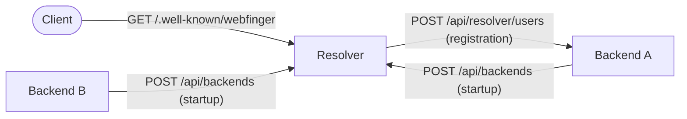

# Archypix — Resolver

The Resolver is the lightweight discovery service that sits in front of one or more Archypix backends sharing the same public identity domain. It maps
`@username:domain` handles to the backend instance that owns the account.

For a full overview of the project, see the [root README](https://github.com/ClementGre/Archypix).

## Role in the architecture



The Resolver is only needed when multiple backends share the same `GLOBAL_DOMAIN`. A single standalone backend can serve its own WebFinger endpoint
directly (set `USE_RESOLVER=false`).

WebFinger lookups are served from an in-process TTL cache before hitting the database.

## Tech stack

Rust, [Axum](https://github.com/tokio-rs/axum), [SQLx](https://github.com/launchbadis/sqlx) + PostgreSQL, [Moka](https://github.com/moka-rs/moka)
cache, [jsonwebtoken](https://github.com/Keats/jsonwebtoken).

## Configuration

```bash
cp .env.example .env
```

The `.env.example` file is fully commented and lists all available variables with their defaults. The mandatory ones are `DB_HOST`, `GLOBAL_DOMAIN`,
`RESOLVER_JWT_SECRET`, and `CORS_ORIGINS`.

`RESOLVER_JWT_SECRET` must be set to the same value on every backend that registers with this resolver.

Log level:

```bash
RUST_LOG=info,archypix_resolver=debug    # default
RUST_LOG=info,archypix_resolver=trace    # verbose: cache and DB hits
```

## Building

Prerequisites: Rust (stable, edition 2024) via [rustup](https://rustup.rs/) and PostgreSQL.

```bash
# Development
cargo run

# Release
cargo build --release
./target/release/archypix-resolver

# Docker
docker build -t archypix-resolver .
docker run -p 8080:8080 --env-file .env archypix-resolver
```

## License

[AGPL-3.0](https://github.com/ClementGre/Archypix/blob/main/LICENSE)
